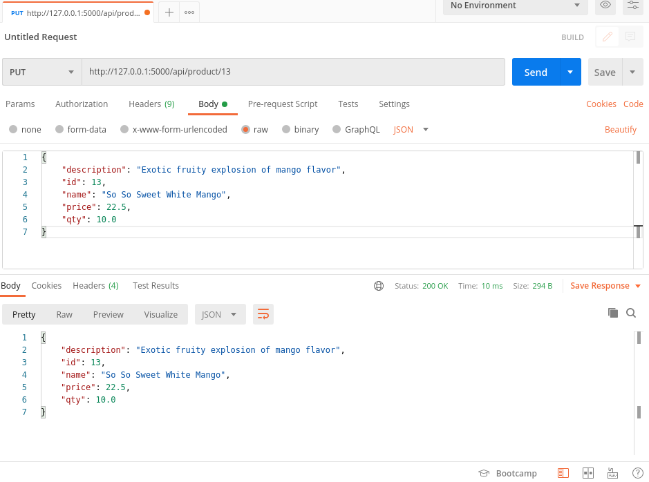

# Images showing the key api routes via Postmaster

## Get all products request

## Get specific product request

## Post a specific product

## Put/Update a specific product

## Delete a specific product

## Retrieve all products to see changes made by the operations above

